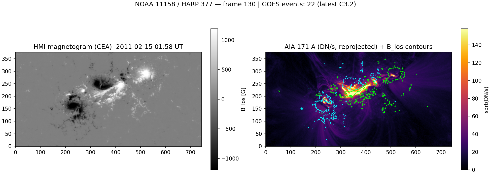
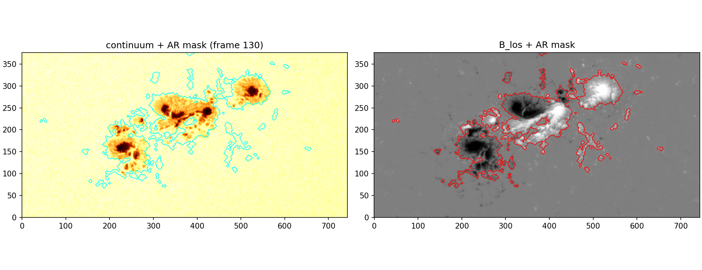
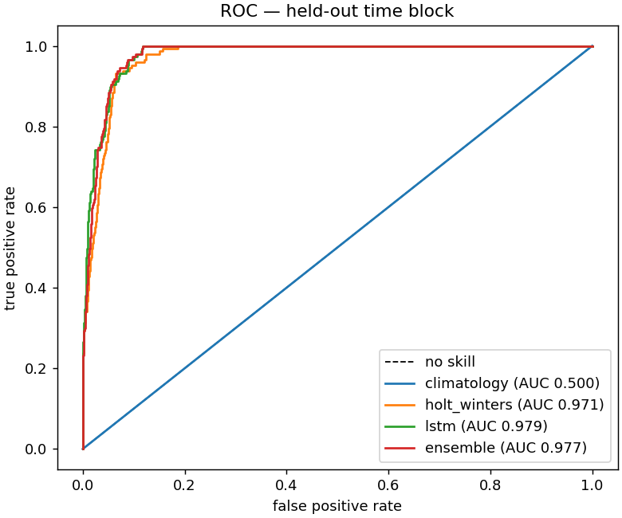
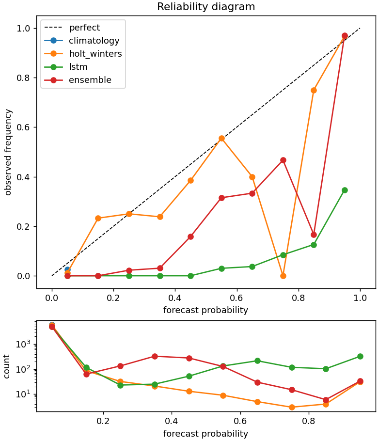
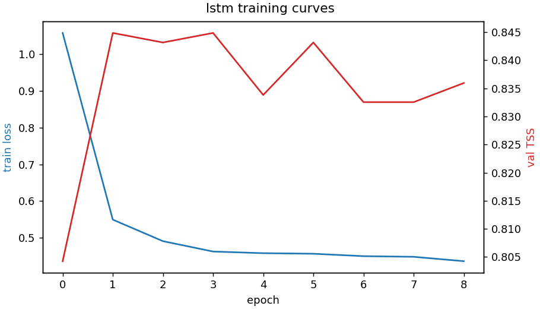
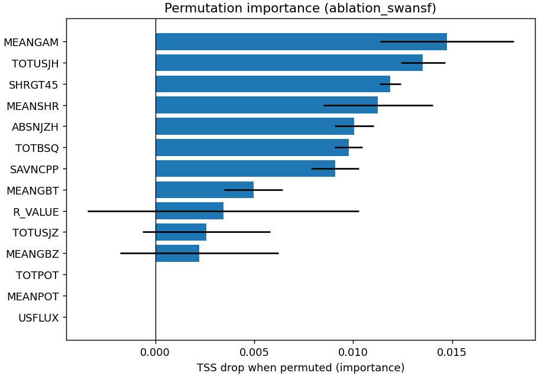

# Tracking Solar Active Regions and Forecasting ≥M-Class Flares from Multi-Wavelength SDO Observations

*Final report skeleton — sections marked `[draft]` carry the recorded results
and figures; prose marked `[expand]` is to be written. Numbers regenerate via
`docs/reproducibility.md`; figures live in `figures/`.*

## 1. Introduction `[expand]`

- Problem: probabilistic ≥M-class flare forecasting per active region with a
  24 h lead, in the lineage of DeepFlareNet (DeFN; Nishizuka et al.).
- Contributions of this pipeline: (i) fully WCS-co-registered per-AR
  HMI+AIA data cubes from cutouts only; (ii) bootstrap labeling from
  HARP/SRS with zero hand-labeling; (iii) strictly leakage-guarded sequence
  datasets (poison-tested); (iv) TSS-first, time-blocked evaluation against
  statistical baselines, de-risked on the public SWAN-SF benchmark.

## 2. Data `[draft]`

- SDO/HMI SHARP CEA cutouts (`hmi.sharp_cea_720s`, magnetogram + continuum,
  720 s) and SDO/AIA 94/131/171/193/211/304/1600/1700 Å JSOC `im_patch`
  cutouts (12 min, rotation-tracked); GOES flare catalog via HEK; NOAA
  cross-identification via the official JSOC HARP↔NOAA mapping.
- MVP sample: NOAA 11158 / HARP 377, 2011-02-14 00:00 → 02-15 12:00 (181
  frames; M6.6, M2.2, X2.2 in window). 10 pixel-aligned (181, 377, 744)
  stacks (~1.9 GB), QA flags on 50/1810 frame-channel entries.
- SWAN-SF partitions 3–4 (12 000 / 6 000 instances, 60 × 12-min steps × 14
  SHARP parameters; positives 3.2 % / 2.5 %).
- Study scope table + quiet window: see README; ±65° CM restriction.

## 3. Methods `[draft]`

- **Co-registration**: per-frame reprojection of exposure-normalized AIA onto
  the time-matched SHARP CEA WCS (differential rotation handled by HARP
  tracking + `im_patch` tracking). Validated by a synthetic blob-alignment
  test and the overlay above.
- **Segmentation/tracking**: each AR is segmented **once** on the HMI
  magnetogram (threshold+morphology baseline; U-Net distilled from it as the
  default, with GPU-gated Surya/SAM2 behind the same `Segmenter` contract); that
  single HMI-rooted mask is propagated to every AIA layer downstream. HARP
  geometry seeds tracking via a rotation-compensated temporal-IoU tracker.
- **Features**: per-step max-in-mask AIA intensity per channel (not mean),
  unsigned/signed flux, peak |B|, area, backward gradients; hourly
  right-edge-labeled resampling.
- **Labels**: ≥M flare of the AR peaking strictly in (t0, t0+24 h];
  features ≤ t0 (poison-the-future test).
- **Models**: climatology; Holt trend + logistic calibration; LSTM (2×64,
  pos-weighted BCE, early stop on val TSS); equal-weight ensemble.
- **Evaluation**: TSS primary (HSS/BSS/Brier/precision/recall reported),
  chronological blocks with 48 h embargo, thresholds frozen on validation.

## 4. Results `[draft]`

### 4.1 Detection & tracking (Gate G2)
| split (held-out window) | recall | precision | matched IoU |
|---|---|---|---|
| val — Sep 2017 | 0.88 | 0.92 | 0.83 |
| test — May 2024 | 0.61 | 0.45 | 0.80 |

Tracker on Oct 2014 (≈20 simultaneous HARPs, 9 days): 39 tracks, HARP purity
1.0 (zero ID switches); AR 12192 mean compensated IoU 0.946.

### 4.2 Forecasting (Gates G4–G5)
SWAN-SF P3 3-fold time-blocked CV / P4 single held-out evaluation:

| model | TSS P3 CV | TSS P4 holdout | AUC P4 |
|---|---|---|---|
| LSTM | 0.770 ± 0.030 | **0.873** | 0.979 |
| ensemble | 0.769 ± 0.025 | 0.872 | 0.977 |
| Holt-Winters | 0.758 ± 0.015 | 0.783 | 0.971 |
| climatology | 0.000 | 0.000 | 0.500 |

Lookback sweep (3/6/12 h): TSS 0.761 / 0.766 / 0.770. Own-data (n=14)
integration run reproduces deterministically via `run-all` (Gate G5).

**DeFN comparison `[expand]`**: same TSS band as DeFN's reported ≈0.80 for
≥M/24 h, on a public benchmark with strictly time-blocked validation; not
directly comparable (sample frame, period, balance handling differ).

## 5. Ablation `[draft]`

Grouped permutation importance (P3-trained LSTM, P4-evaluated): magnetic
shear and current-helicity parameters dominate — MEANGAM, TOTUSJH, SHRGT45,
MEANSHR, ABSNJZH — consistent with the flaring-AR literature. Caveat:
SHARP parameters are strongly inter-correlated, so absolute ΔTSS values
(~0.01) understate grouped information content. AIA-channel ablation on the
single-AR MVP dataset executes but is reported without conclusions (n=14).

## 6. Limitations `[draft]`

1. LSTM probabilities are miscalibrated (pos-weight inflation; negative BSS);
   TSS/ROC unaffected. Needs Platt/isotonic calibration.
2. Own-data results rest on one AR / 36 h; the AIA-channel science question
   (confined vs eruptive separation) is open until more windows are fetched.
3. Detector over-predicts on the crowded May-2024 disk (86 positive training
   frames); box quality is unaffected (IoU ≥ 0.80).
4. UV 1700 Å coverage is sparse at 720 s sampling (flagged, not dropped).
5. CEA pixel units (G·px / px) deferred to physical units by one documented
   constant.

## 7. Future work `[expand]`

- Fetch the remaining study windows (the only bottleneck, ≈3.5 h each) →
  multi-AR dataset → re-run the AIA ablation with statistics.
- Probability calibration + per-AR operational view (Streamlit, deferred).
- U-Net segmentation upgrade behind the existing mask interface.
- ≥C task and 1/3/6 h lead variants (already configurable in the builder).

## Reproducibility

Environment lockfile, seeds, exact commands, runtimes and platform gotchas:
[docs/reproducibility.md](../docs/reproducibility.md). All metric values
above trace to `outputs/experiments.csv` (git SHA + config hash per row).
